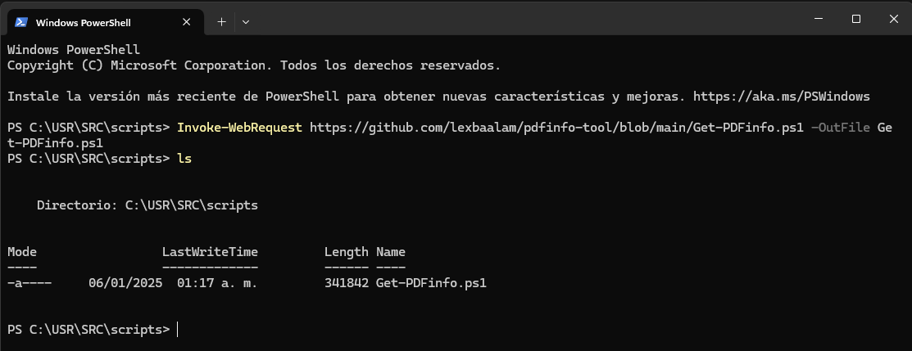
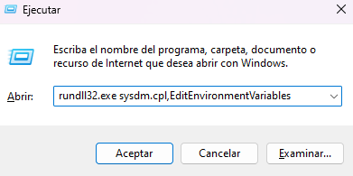
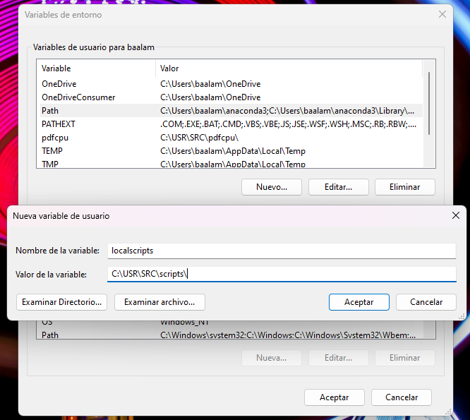
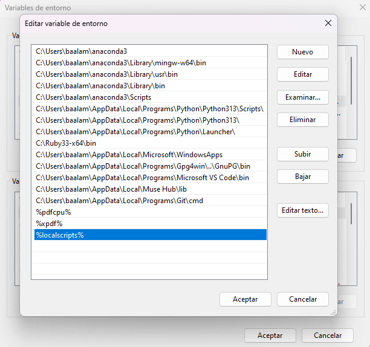
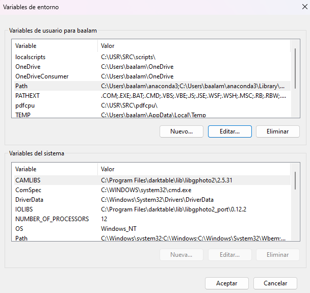
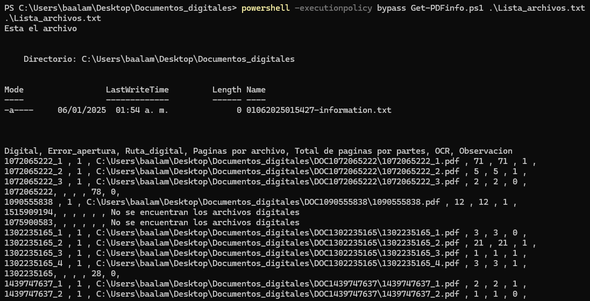
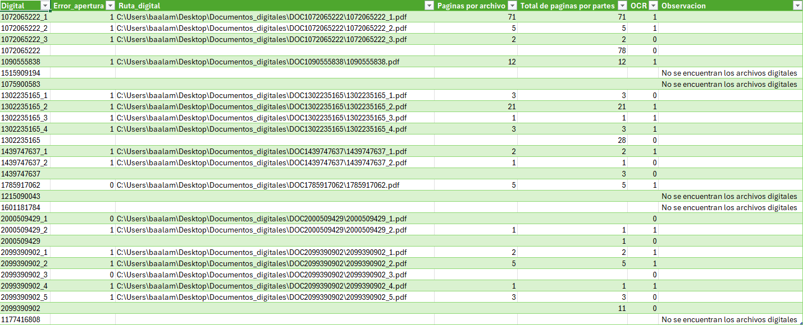

# Pdfinfo-tools

Son scripts hechos en bash (en desarrollo) y PowerShell con la finalidad de obtener información de los metadatos de archivos en formato en PDF.

En muchas situaciones es necesario conocer cierta información de archivos digitales en formato PDF, para realizar un inventario de la información contenida en estos archivos. Realizar un inventario de forma manual se puede convertir en una tarea tediosa si la cantidad de archivos digitales es demasiado grande.

La idea principal de estos scripts determinar si en un lote de archivos en PDF no contienen errores de apertura, esto es, hay un error al momento de abrir el archivo. Determinar el número de páginas, si contienen OCR y determinar la ruta de ubicación en el disco duro de nuestro equipo con la finalidad de poder localizarlos más eficientemente. El archivo de texto que se genera una vez ejecutado el _script_ proporciona la información descrita anteriormente de todos los archivos en PDF que se encuentren en la carpeta, esto se logra a través de un archivo que contiene una lista de nombres de los documentos en PDF que será la entrada que se proporcionará al _script_ de Bash o de PowerShell.

## Dependencias para Windows 11

Las dependencias para Windows 11 son los ejecutables de la biblioteca XpdfReader que se pueden obtener desde el sitio oficial [https://www.xpdfreader.com/](https://www.xpdfreader.com/) y el ejecutable para Windows 11 de 64 bit de la herramienta pdfcpu que se puede obtener desde repositorio oficial de GitHub del proyecto en [https://github.com/pdfcpu/pdfcpu/releases/tag/v0.9.1](https://github.com/pdfcpu/pdfcpu/releases/tag/v0.9.1).

Una vez descargadas ambas bibliotecas y descomprimidas se deben colocar en una carpeta que a su vez se tiene que agregar al _path_ de la cuenta local para poder ser manipuladas desde la terminal.

## Instalación del _script_ escrito en PowerShell

El script para Windows 11 se debe colocar en una ubicación del disco que tenga una ruta corta para no ocasionar problemas con el _path_ del sistema. A modo de ejemplo, se establecerá la ruta "C:\USR\SRC\scripts\" como carpeta para ejecutar cualquier _script_ escrito en PowerShell en nuestro sistema operativo. 

Es necesario abrir una terminal de PowerShell y ubicarnos en la ruta anterior, posteriormente ejecutamos el siguiente comando para descargar el _script_ de PowerShell que funcionará en nuestro sistema operativo Windows 11. 

    Invoke-WebRequest https://raw.githubusercontent.com/lexbaalam/pdfinfo-tool/refs/heads/main/Get-PDFinfo.ps1 -OutFile Get-PDFinfo.ps1

Al ejecutar el comando se iniciará la descarga del archivo con el nombre Get-PDFinfo.ps1, después es necesario agregar al _path_ del sistema la ruta anterior.

Con las teclas WIN + r se desplegará una pequeña ventana para ejecutar comandos, en ella escribimos el comando rundll32.exe sysdm.cpl,EditEnvironmentVariables y damos clic en aceptar. Esto último abrirá el recuadro donde definiremos una variable de entorno para ejecutar nuestros _scripts_ de forma local.

En la ventana que se muestra se definen las variables de entorno para la cuenta local, daremos clic en nuevo y en la primera barra escribiremos el nombre de la variable de entorno, en este caso se escribirá _localscripts_ y en la segunda barra escribiremos la ruta "C:\USR\SRC\scripts\".

Dar clic en aceptar, y luego se debe seleccionar la variable _path_ y después se elegirá la opción editar. En la nueva ventana que emerge dar nuevamente clic en editar y escribiremos -_%localscripts%_. Finalmente, damos clic en aceptar para cerrar la ventana de edición de las variables.

El último paso consiste en dar clic en el botón aceptar de la última ventana y con esto ya estaría funcionando el _script_ en la terminal de PowerShell.

### Ejecución del _script_

Puesto que se estableció desde el principio que la instalación se llevaría a cabo desde una cuenta local sin privilegios de administrador, la ejecución del mismo requiere abrir la carpeta donde se encuentran los archivos PDF y escribir el siguiente comando:

    powershell -executionpolicy bypass Get-PDFinfo.ps1 Lista_archivos.txt

El archivo Lista_archivos.txt contendrá una lista con los nombres de los archivos en PDF, esta lista solo estará compuesta por la base del nombre sin extensiones.

    Lista_archivo.txt 

    1072065222
    1090555838
    1515909194
    1075900583
    1302235165
    1439747637
    1785917062
    1215090043
    1601181784
    2000509429
    2099390902
    1177416808

La ejecución generará un archivo TXT con la información de los metadatos de cada documento buscado de forma recursiva en la carpeta y que puede ser exportado a Excel.

## Algunas consideraciones

* En **error_apertura**, el 1 significa que si se pudo abrir y el 0 que no se pudo abrir el archivo.
* En **OCR**, el 1 significa que el archivo sí tiene OCR y el 0 si no tiene OCR.
* En caso de haber partes de un archivo, el _script_ calcula individualmente la cantidad de páginas por archivo, para ello hay dos casos:
    * Si hay partes, se calcula individualmente y posteriormente se indica el total de todas las partes en la pestaña de **Total de páginas por partes**.
    * Si solo hay una parte, las pestañas **Páginas por archivo** y **Total de páginas por partes** tendrán la misma cantidad.
* Cuando no se encuentra un archivo simplemente se pondrá en observaciones la leyenda **No se encuentran los archivos digitales**